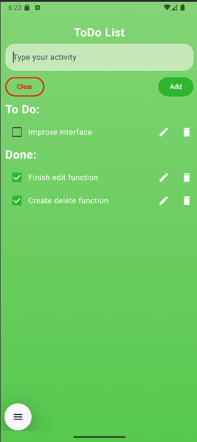
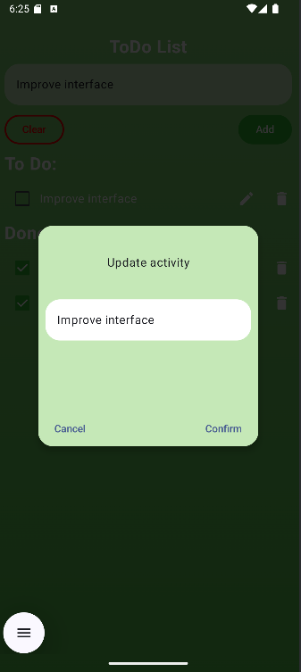
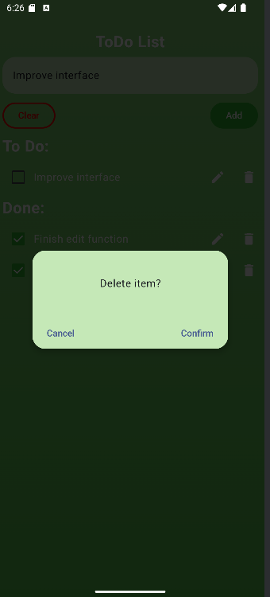

  <h3 align="center">To Do list App</h3>

  

    A basic To Do list implemented to learn Kotlin and basic frontend concepts
  

<h3 align="center">Features</h3>
<ul>
    <li>Create a to do activity</li>
    <li>See you to do and done activities</li>
    <li>Check a activity to mark as done</li>
    <li>Confirm before delete a activity</li>
    <li>Edit the activity</li>
    <li>Very questionable color palette 👍</li>
</ul>
<h3 align="center">Screenshots</h3>

    
    
    

<h3 align="center">About the development</h3>

  This app was developed as a assignment for college. Developing it I learned a few more about frontend and mobile development (something I don't do often beacause I just don't like it that much). The language used was Kotlin and the framework was Jetpack Compose. The app is very simple, but I could learn a lot about the concepts of frontend, like state management, components, etc. The proof of my backend preferences can be noticed in the poor design of the app. (I hope someone read this before judge my code...)

